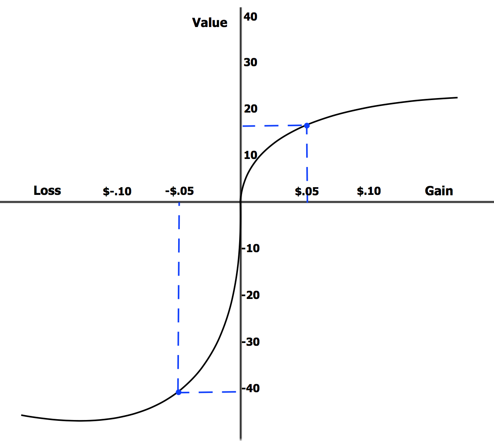

```{r setup, include=FALSE}
knitr::opts_chunk$set(echo = FALSE)
```

## Today

- Discussion
- Economics of Risk
- Risk and Development

## Discussion: Part 1

In groups, discuss:

- What are the most important development problems caused by risk?

## Discussion: Part 1

Of the problems you identified:

- Which can be addressed by government? How?
- Which can be addressed by the private sector? How?

# Economics of Risk

## The St. Petersburg Paradox

A casino game:

- A coin is flipped at each stage
- If heads, $2 goes into pot on first flip
- Each additional heads doubles the pot
- First tails: game ends, collect pot contents

How much would you pay to play?

## The St. Petersburg Paradox

$$
E = \frac{1}{2}2+\frac{1}{4}4+\frac{1}{8}8 + \frac{1}{16}16+...=\infty
$$
... the expected value is infinite!

So why did nobody bid infinity or even a very large number?

## Daniel Bernoulli (1738)
<div class="columns-2">
 {width=80%}

  **diminishing marginal utility** implies **risk aversion**
</div>

## Expected Utility Theory

Humans make decisions based on $E[U(L)]$, not $E[L]$.

Note: $L$ is not a variable, it is a lottery. 

For example, if we define $L$ as a lottery that pays 1 with probability 1/2 and 10 with probability 1/2. $E[L] = \frac{1}{2}1 + \frac{1}{2}10 = 5.5$.

Suppose we have a log utility function. Then $E[U(L)] = \frac{1}{2}\ln(1) + \frac{1}{2}\ln(10) =  \frac{1}{2}\ln(10) \approx 1.15$. 

But $\ln(5.5) \approx 1.7$. 

So a risk averse agent prefers 5.5 with certainty to $L$; a risk neutral agent doesn't care.

## von Neumann-Morgenstern

Argue that expected utility = rationality. Four axioms:

1. Completeness: given any two things, I either prefer one or like them equally.
2. Transitivity: if I prefer A to B and B to C, I prefer A to C.
3. Independence of irrelevant alternatives: if I prefer A to B, I also prefer A+Z to B+Z (where Z is another lottery).
4. Continuity: there is some combination of A and B I like equally to C.

If these hold for a person, they must be an expected utility maximizer.

## Arrow-Debreau Model (1954)

Core way of thinking about risk:

- A commodity can be a thing in a certain *state of the world*.
- Example: today I can offer you a pupusa if it rains tomorrow. You'll pay a discount since rain tomorrow is unlikely.
- These conditional goods are called securities.
- Theoretical result: prices should exist for everything in every state of the world, which allows people to optimally manage risk.
- Actual result: securities became very complex and buyers failed to understand them.

## Prospect Theory (1979)


<div class="columns-2">
 

  Kahneman/Tversky seek to explain why real people frequently violate expected utility theory.
  
  Key idea: people make decisions relative to a reference point.
  
  Rather than a concave function (risk averse everywhere), posit risk-aversion in gains, risk-seeking in losses.
  
  {width=100%}
</div>

## Prospect Theory Implications

- Underinvestment in insurance relative to EU (risk averse in losses).
- Endowment effect
- Equity premium puzzle

Problem: sometimes violates first-order stochastic dominances (predicts choosing something that is always worse).

## Cumulative Prospect Theory

Adds probability weighting (overweighting of very likely or unlikely events) to PT.

Idea came from Quiggin (1982). Solves first-order stochastic dominance problem.

## In Summary

Expected utility theory is elegant and easy to use, but people sometimes violate it.

CPT fits some behavior better, but involves many parameters + reference points, so it is harder to use.

# Risk and Development

## Risk and Development

Risk matters because:

- People in developing countries often have especially risky lives due to dependence on agriculture, entrepreneurship.
- Macro-risks are also often greater in developing countries: currency risk, political risk.
- Incomplete markets for credit and insurance make all of this worse.

Risk may be one of the major factors perpetuating poverty.

## Risk and Inequality

Poor people (often) have:

- Less tolerance for risk
- Less access to risk mitigation (credit, insurance)
- Greater risk in general

This can perpetuate or exacerbate inequality (Carter + Zimmerman)

## Risk and Investment

(Uninsured) risk makes investment unappealing.

How does this connect to expected utility theory?

What different predictions might prospect theory make?

## How to Reduce Risk?

- Social safety nets (e.g. UBI, health insurance)
- Credit
- Private Insurance (but remember, moral hazard + adverse selection)
- Informal Insurance
- Sound macroeconomic policy + political stability
- Diversified economy
- Other ideas?

## Index Insurance

- Uses an index (e.g. average regional crop yields, satellite estimates)
- Pays farmers when insurance falls below threshold.
- How does this affect moral hazard?

Research to date: some evidence of benefits in terms of investment + protection, but take-up at commercially viable rates is often low.

## In Summary

Risk can:

- Increase inequality
- Increase poverty
- Slow growth
- Discourage investment

Reducing risk is hard, but has major benefits! 

New and better ideas are needed.


